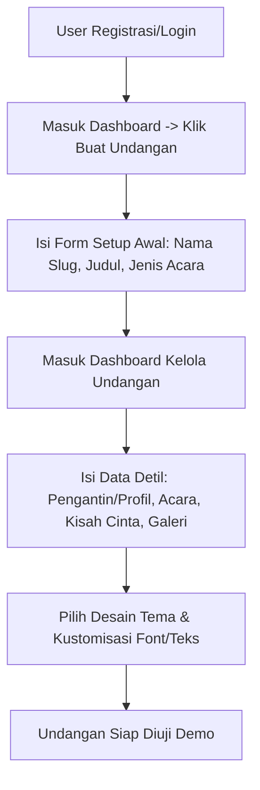
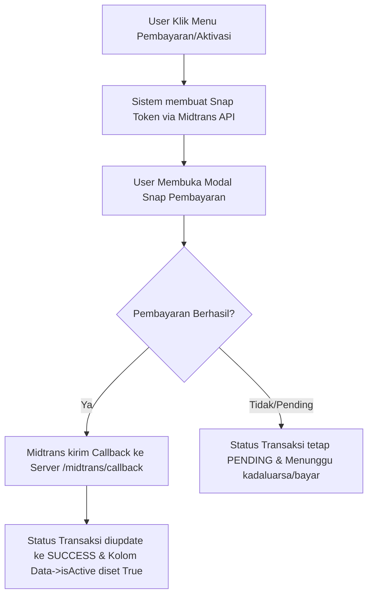
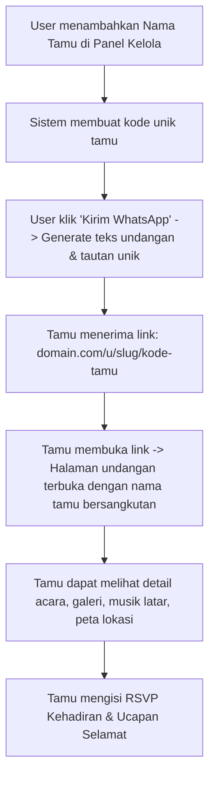

# Dokumentasi Aplikasi Undangan Digital (Digital Invitation System)

Aplikasi **Undangan Digital** adalah platform berbasis web yang memungkinkan pengguna untuk membuat, mengelola, mendesain, dan membagikan undangan digital (untuk acara pernikahan, ulang tahun, dan jenis event lainnya) dengan mudah, cepat, dan interaktif.

---

## 1. Ringkasan Proyek

Platform ini didesain secara mandiri dengan konsep _Self-Service SaaS (Software as a Service)_, di mana pengguna dapat mendaftar, memilih tema yang disukai, mengisi informasi detail acara mereka, menyesuaikan pengaturan (musik, font, kustomisasi teks, cerita cinta, galeri foto/video, kado digital/angpao), serta membagikan link undangan unik ke daftar tamu mereka. Aplikasi ini juga dilengkapi dengan integrasi pembayaran **Midtrans** untuk proses aktivasi paket undangan premium secara otomatis, serta panel administrasi (**Owner**) khusus untuk memantau sistem.

---

## 2. Arsitektur & Teknologi (Tech Stack)

Aplikasi dibangun menggunakan teknologi modern berbasis PHP dan ekosistem Laravel:

- **Core Framework**: [Laravel 10.x](https://laravel.com/) (Menyediakan backend MVC yang aman, ORM Eloquent, routing yang kuat, dan struktur migration terorganisir).
- **Frontend Interactivity**: [Laravel Livewire 3.x](https://livewire.laravel.com/) (Memungkinkan pembuatan antarmuka dinamis dan reaktif secara real-time tanpa perlu berpindah halaman atau menulis banyak JavaScript).
- **User Authentication**: [Laravel Breeze](https://laravel.com/docs/10.x/breeze) (Menyediakan scaffolding autentikasi yang minimalis dan aman).
- **Styling**: [Tailwind CSS](https://tailwindcss.com/) & [Vite](https://vitejs.dev/) (Untuk penyusunan aset CSS modern, performa tinggi, dan responsif terhadap perangkat mobile/desktop).
- **Database**: [MySQL](https://www.mysql.com/) (Menyimpan data relasional pengguna, undangan, pengaturan, transaksi, tamu, dan ucapan).
- **Payment Gateway**: [Midtrans PHP SDK](https://midtrans.com/) (Menangani transaksi pembayaran secara online untuk aktivasi paket undangan menggunakan Snap API).
- **Role & Permission**: [Spatie Laravel Permission](https://spatie.be/docs/laravel-permission) (Mengatur hak akses antara pengguna biasa / **User** dan administrator / **Owner**).

---

## 3. Fitur Utama Aplikasi

### A. Fitur Pengguna (User / Client)

1.  **Registrasi & Login**: Keamanan akun pengguna untuk mengelola data undangan mereka secara personal.
2.  **Pemilihan Jenis Acara**: Mendukung berbagai jenis acara, utamanya **Pernikahan (Wedding)** dan **Ulang Tahun (Birthday)**.
3.  **Kustomisasi Informasi Mempelai/Profil**:
    - Detail Mempelai Pria (Nama lengkap, panggilan, nama orang tua, foto, username/sosial media).
    - Detail Mempelai Wanita (Nama lengkap, panggilan, nama orang tua, foto, username/sosial media).
    - Detail Profil Ulang Tahun (Nama, usia, foto profil, dll.).
4.  **Kustomisasi Acara & Jadwal**: Mengatur detail tanggal, waktu, lokasi, nama tempat, dan link peta navigasi (Google Maps) untuk beberapa sub-acara (misalnya Akad Nikah, Resepsi, Acara Utama).
5.  **Galeri Media**: Unggah galeri foto dan video prewedding/dokumentasi.
6.  **Kisah Cinta (Love Story)**: Menambahkan lini masa (timeline) momen perjalanan cinta mempelai beserta foto pendukung.
7.  **Musik Latar (Background Music)**: Memilih koleksi lagu/musik romantis atau mengunggah lagu kustom untuk dimainkan otomatis saat undangan dibuka.
8.  **Streaming Acara**: Mengintegrasikan tautan siaran langsung (Live Streaming) melalui Zoom, YouTube Live, Instagram Live, dll.
9.  **Kado & Angpao Digital**:
    - Integrasi transfer bank (Nomor rekening, nama bank, atas nama pemilik).
    - Integrasi e-wallet / dompet digital.
    - Dapat menggunakan pembayaran instan QRIS / Midtrans untuk mempermudah tamu mengirim kado digital.
10. **Buku Tamu & RSVP Interaktif**:
    - Tamu dapat mengirimkan ucapan doa secara langsung di halaman undangan.
    - Tamu dapat mengonfirmasi kehadiran mereka (Hadir, Ragu-ragu, Tidak Hadir).
11. **Manajemen Pengaturan Undangan (Settings)**:
    - Mengatur jenis dan ukuran font (Google Fonts) untuk judul (_Title_) maupun paragraf (_Body Text_).
    - Mengatur kustomisasi kata pembuka, isi teks acara, dan kata penutup.
    - Menyesuaikan isi template WhatsApp pengiriman undangan.
    - Mengatur gambar Miniatur / Thumbnail WhatsApp (OpenGraph image) agar ketika tautan dibagikan di WA, muncul gambar kustom buatan pengguna.
12. **Manajemen Tamu Undangan (Guest Management)**:
    - Memasukkan daftar nama tamu.
    - Menghasilkan tautan unik secara otomatis untuk setiap tamu (misal: `domain.com/u/nama-slug/kode-tamu`).
    - Tombol salin pesan undangan otomatis yang siap dikirim langsung ke WhatsApp tamu bersangkutan.
13. **Metode Transaksi & Aktivasi**:
    - Membayar biaya langganan paket undangan secara instan via Midtrans (E-wallet, Virtual Account, Credit Card).
    - Konfirmasi pembayaran otomatis (Callback Midtrans).
    - Dukungan pembayaran tunai (Manual/Admin approval jika diperlukan).

### B. Fitur Administrator (Owner)

1.  **Dashboard Utama**: Memantau ringkasan total pengguna, total undangan aktif, total transaksi masuk, serta data statistik lainnya.
2.  **Kelola Tema (Theme Management)**: Menambah, mengubah, atau menghapus template desain undangan digital yang akan ditawarkan ke pengguna.
3.  **Kelola Kategori & Jenis Acara**: Mengonfigurasi parameter jenis event (Pernikahan, Ulang Tahun, Syukuran, dll.).
4.  **Kelola Harga & Promo**:
    - Mengatur daftar harga paket langganan (Price List).
    - Membuat kode kupon diskon/promo aktif untuk menarik pengguna.
5.  **Kelola Transaksi**: Memantau daftar transaksi masuk, melihat status pembayaran (pending, success, failed, expire), dan menyetujui metode pembayaran manual.
6.  **Kelola Pengguna**: Melihat list pengguna terdaftar dan mengelola status akun mereka.
7.  **Kelola Aset Font & Animasi**: Menambahkan jenis font web baru dan konfigurasi efek animasi CSS guna memperkaya estetika undangan digital.
8.  **Pengaturan Sistem**: Mengonfigurasi detail nama aplikasi, logo, kontak bantuan, dan konfigurasi API Midtrans.

---

## 4. Skema Database & Relasi Utama

Model data pada aplikasi ini saling berelasi dengan model utama `Data` sebagai pusat penyimpanan entitas undangan.

### A. Entitas Utama: `Data`

Model `App\Models\Data` merepresentasikan satu instansi undangan digital yang dimiliki oleh seorang `User`. Kolom utamanya meliputi:

- `user_id`: Kunci tamu (foreign key) ke tabel `users`.
- `theme_id`: Kunci tamu ke tabel `themes`.
- `event_type_id`: Kunci tamu ke tabel `event_types`.
- `title`: Nama proyek undangan.
- `slug`: Alamat URL unik undangan (misal: `pernikahan-budi-riri`).
- `uid`: ID acak unik (4 karakter) sebagai pengidentifikasi singkat.
- `isActive`: Status aktivasi/penerbitan undangan.

### B. Hubungan Relasi Model (Eloquent Relationships)

- `pria()` & `wanita()` (1-to-1): Data diri pengantin pria dan wanita (`Pria`, `Wanita`).
- `birthdayProfile()` (1-to-1): Profil anak/orang yang berulang tahun (`BirthdayProfile`).
- `eventDetail()` (1-to-1): Detail waktu, tanggal utama, alamat lokasi, peta (`EventDetail`).
- `acara()` (1-to-many): Daftar sub-kegiatan acara seperti Akad Nikah, Resepsi, Unduh Mantu, dll. (`Acara`).
- `galery()` (1-to-many): Foto dan video dokumentasi acara (`Galery`).
- `sound()` (1-to-1): Latar musik terpilih (`Sound`).
- `tamu()` (1-to-many): List tamu yang diundang (`Tamu`).
- `ucapan()` (1-to-many): Kumpulan ucapan doa restu dan konfirmasi kehadiran dari tamu (`Ucapan`).
- `kisah()` & `imageKisah()` (1-to-many): Lini masa cerita perjalanan cinta (`KisahCinta`, `ImgKisahCinta`).
- `transaction()` (1-to-many): Catatan transaksi pembayaran undangan (`Transaction`).
- `dataFont()` (1-to-1): Pengaturan tipografi kustom (Font judul & teks biasa) (`DataFonts`).
- `setting()` (1-to-1): Kontrol tampilan kolom undangan aktif/nonaktif (`Setting`).
- `qoute()` (1-to-1): Kata kutipan mutiara / ayat suci (`Qoute`).
- `teksUndangan()`, `coverUndangan()`, `teksWhatsApp()`, `teksPenutup()`, `thumbnailWas()` (1-to-1): Pengaturan kustomisasi konten tekstual dan media penunjang undangan.

---

## 5. Struktur Direktori Utama

Berikut penjelasan singkat mengenai letak file penting pada aplikasi Laravel ini:

```text
undangan-digital/
├── app/
│   ├── Http/
│   │   ├── Controllers/
│   │   │   ├── Auth/                 # Logika Registrasi, Login, Lupa Password
│   │   │   ├── Dashboard/            # Logika Setup & Data Dashboard
│   │   │   ├── Pay/                  # MidtransController (Proses Pembayaran)
│   │   │   ├── TemaController.php    # Merender undangan & menangani RSVP Doa
│   │   │   └── ExploreController.php # Halaman katalog tema
│   ├── Livewire/                     # Komponen reaktif Laravel Livewire
│   │   ├── AdminDemo/                # Komponen panel dashboard Owner/Admin
│   │   └── DashboardDemo/            # Komponen panel dashboard User
│   │       └── Kelola/               # Kelola Acara, Tamu, Galeri, Desain, dsb.
│   └── Models/                       # Model representasi tabel database
│       └── KelolaUndangan/           # Model data internal undangan (Pria, Tamu, dll.)
├── config/                           # File konfigurasi Laravel (app, database, services, dll.)
├── database/
│   ├── migrations/                   # Struktur skema tabel database
│   └── seeders/                      # Data awal (Roles, Fonts, Event Types, Music, dll.)
├── public/                           # Aset statis yang diakses publik (CSS, JS, Uploaded files)
├── resources/
│   ├── views/                        # Template HTML (Blade)
│   │   ├── landingpage/              # Tampilan Landing Page & Fitur Explore
│   │   ├── layouts/                  # Kerangka Layout Blade induk
│   │   ├── livewire/                 # UI khusus dari komponen Livewire
│   │   ├── tema/                     # Template desain Undangan Digital (blade views)
│   │   └── user/                     # Halaman konfigurasi/dashboard pengguna
│   └── js/ & css/                    # Aset mentah frontend (Tailwind/Vite)
├── routes/
│   ├── web.php                       # Definisi seluruh rute halaman web & kontroler
│   └── api.php                       # Rute API (bila ada)
├── tailwind.config.js                # Konfigurasi utility Tailwind CSS
├── vite.config.js                    # Konfigurasi bundler aset Vite
└── .env                              # Variabel konfigurasi lingkungan / rahasia
```

---

## 6. Alur Kerja Utama Aplikasi

### A. Alur Pembuatan Undangan



### B. Alur Transaksi & Aktivasi



### C. Alur Pengiriman & Pembukaan Undangan oleh Tamu



---

## 7. Panduan Instalasi & Menjalankan Aplikasi

Ikuti langkah-langkah di bawah ini untuk memasang aplikasi di lingkungan pengembangan lokal (_Local Development_):

### Prasyarat System:

- PHP Versi `^8.2`
- Composer (Dependency Manager PHP)
- Node.js & NPM
- Database MySQL / MariaDB

### Langkah Instalasi:

1.  **Clone / Masuk ke Direktori Proyek**:
    Pastikan Anda berada di root direktori proyek `undangan-digital`.

2.  **Instalasi Dependensi PHP (Composer)**:
    Jalankan perintah berikut pada terminal:

    ```bash
    composer install
    ```

3.  **Instalasi Dependensi Frontend (NPM)**:
    Pasang paket pustaka Javascript dan CSS:

    ```bash
    npm install
    ```

4.  **Konfigurasi Variabel Lingkungan (`.env`)**:
    Salin file `.env.example` menjadi `.env` jika belum ada:

    ```bash
    cp .env.example .env
    ```

    Buka file `.env` dan konfigurasikan koneksi database Anda:

    ```env
    DB_CONNECTION=mysql
    DB_HOST=127.0.0.1
    DB_PORT=3306
    DB_DATABASE=undangan_digital
    DB_USERNAME=root
    DB_PASSWORD=your_password
    ```

5.  **Generate Application Key**:

    ```bash
    php artisan key:generate
    ```

6.  **Migrasi & Seed Database**:
    Jalankan migrasi database beserta data benih bawaan (Role, Font, Jenis Acara, Musik default):

    ```bash
    php artisan migrate --seed
    ```

7.  **Hubungkan Tautan Penyimpanan (Storage Link)**:
    Buat symlink agar gambar/foto mempelai dan galeri yang diunggah ke folder `storage` dapat diakses secara publik:

    ```bash
    php artisan storage:link
    ```

8.  **Menjalankan Aplikasi**:
    Jalankan server lokal PHP:
    ```bash
    php artisan serve
    ```
    Dan jalankan server kompilasi aset frontend Vite di terminal terpisah:
    ```bash
    npm run dev
    ```
    Buka browser di `http://127.0.0.1:8000` untuk melihat aplikasi Anda berjalan.

---

## 8. Konfigurasi Pembayaran (Midtrans)

Untuk mengaktifkan fitur pembayaran otomatis, Anda perlu mendapatkan Server Key dan Client Key dari akun sandbox/production Midtrans Anda, kemudian memasukkannya ke file `.env`:

```env
MIDTRANS_SERVER_KEY="Masukkan_Server_Key_Midtrans_Anda"
MIDTRANS_CLIENT_KEY="Masukkan_Client_Key_Midtrans_Anda"
MIDTRANS_IS_PRODUCTION=false
MIDTRANS_IS_SANITIZED=true
MIDTRANS_IS_3DS=true
```

Sistem sudah memiliki penangan callback `/midtrans/callback` yang mendengarkan notifikasi webhook dari Midtrans untuk mengamankan status pembayaran dan mengaktifkan status undangan (`isActive`) secara real-time.

---

## 9. Kesimpulan

Aplikasi **Undangan Digital** dirancang secara modular dan mudah dikembangkan lebih lanjut. Berkat penggunaan Laravel Livewire, pemrosesan form, manajemen tamu, dan penyesuaian kustomisasi teks dapat berjalan tanpa interupsi _refresh_ halaman secara keseluruhan, memberikan kenyamanan maksimal bagi para calon pengantin atau penyelenggara acara dalam merancang undangan digital impian mereka.
